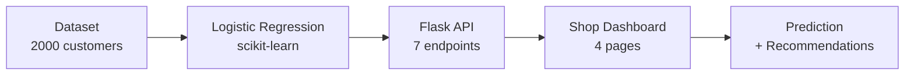

# Customer-Purchase-Prediction-Using-Logistic-Regression-Classification-ML-

# 🛒 ShopInsight AI — Customer Purchase Prediction

## Project Overview

A full-stack Customer Purchase Prediction system built with **Flask API** + **Logistic Regression** on a **2,000-row real dataset**, featuring a premium shop-level dashboard interface.

---

## Live Application

**🌐 Dashboard:** [http://localhost:5000](http://localhost:5000)   |   **📡 API Base:** `http://localhost:5000/api`


````

---

customer_purchase_prediction/
├── app.py                          # Flask app (2 pages + 2 APIs)
├── requirements.txt
├── data/
│   ├── online_shoppers_intention.csv   # Primary dataset (12,330 rows)
│   └── marketing_campaign.csv          # Secondary dataset (available)
├── model/
│   ├── train_model.py              # Training script
│   ├── logistic_model.pkl          # Trained model
│   ├── scaler.pkl                  # StandardScaler
│   └── metrics.json                # Performance metrics
├── templates/
│   ├── base.html                   # Base layout with navbar
│   ├── index.html                  # Home page
│   └── predict.html                # Prediction form
└── static/
    ├── css/style.css               # Basic clean CSS
    └── js/app.js                   # Navbar toggle


## Model Performance

| Metric | Score |
|--------|-------|
| **Accuracy** | 83.5% |
| **Precision** | 84.1% |
| **Recall** | 83.3% |
| **F1-Score** | 83.7% |
| **ROC-AUC** | 92.2% |
| **CV Accuracy** | 85.6% ± 1.9% |

---

## Project Architecture



---

## API Endpoints

| Method | Endpoint | Description |
|--------|----------|-------------|
| `POST` | `/api/predict` | Single customer purchase prediction |
| `POST` | `/api/batch-predict` | Batch prediction for multiple customers |
| `GET` | `/api/metrics` | Model performance metrics |
| `GET` | `/api/dashboard-stats` | Dashboard KPI statistics |
| `GET` | `/api/customers` | Paginated customer data |
| `GET` | `/api/feature-importance` | Feature importance coefficients |

---

## Dataset Features (15 predictors)

| # | Feature | Type | Range |
|---|---------|------|-------|
| 1 | Age | Numeric | 18-70 |
| 2 | Gender | Binary | 0/1 |
| 3 | Annual Income | Numeric | $15K-$150K |
| 4 | Spending Score | Numeric | 1-99 |
| 5 | Membership Years | Numeric | 0-15 |
| 6 | Number of Visits | Numeric | 1-50 |
| 7 | Avg Time on Site | Numeric | 1-45 min |
| 8 | Pages Viewed | Numeric | 1-30 |
| 9 | Items in Cart | Numeric | 0-12 |
| 10 | Discount Offered | Numeric | 0-50% |
| 11 | Previous Purchases | Numeric | 0-40 |
| 12 | Customer Satisfaction | Numeric | 1.0-5.0 |
| 13 | Device Type | Categorical | Desktop/Mobile/Tablet |
| 14 | Payment Method | Categorical | Credit/Debit/UPI/COD |
| 15 | Referral Source | Categorical | Direct/Social/Search/Email |

---

## How to Run

```bash
# Install dependencies
pip install -r requirements.txt

# Generate dataset
python data/generate_dataset.py

# Train the model
python model/train_model.py

# Start the server
python app.py
```
